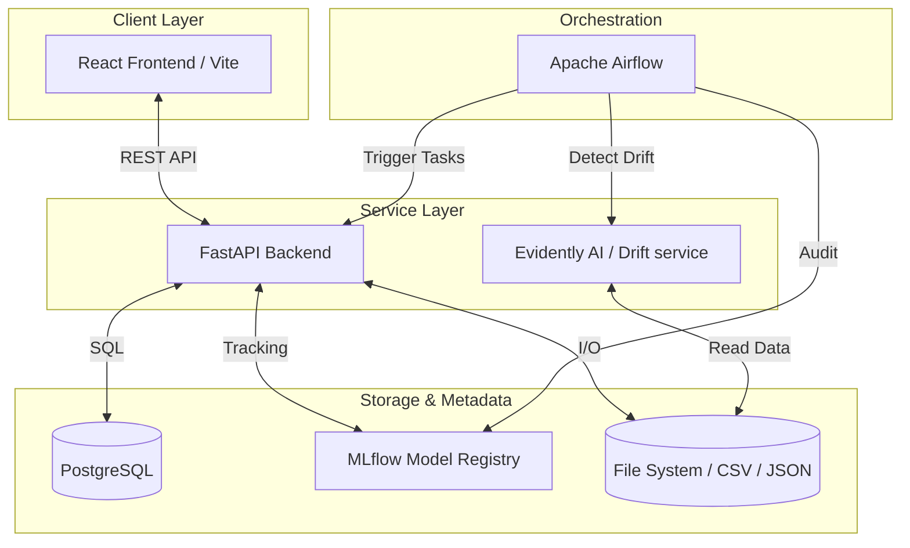

## Submission Details

**Candidate Name:** Pranav Viswanathan

**Scenario Chosen:** Green-Tech Inventory Assistant — AI-powered inventory management with ML stockout prediction, drift detection, and autonomous retraining.

**Estimated Time Spent:** 5.5 hours

**Video Walkthough:** https://youtu.be/y_g3FXVzKWQ

---

## Quick Start

**Prerequisites:**
- Docker Desktop with Compose v2 installed and running
- 4GB+ RAM allocated to Docker
- Git

**Run Commands:**
```bash
git clone <repo-url>
cd green-tech-inventory
cp .env.example .env          # add your OPENAI_API_KEY if desired
./start.sh init               # starts all services, seeds data, trains model, activates DAGs
```

**Test Commands:**
```bash
docker compose exec backend pytest tests/ -v
```

---

## AI Disclosure

- **Did you use an AI assistant (Copilot, ChatGPT, etc.)?** Yes — used an AI coding assistant for scaffolding boilerplate (Dockerfiles, route handlers, React components).
- **How did you verify the suggestions?** All generated code was reviewed line-by-line, run inside Docker, and validated via the pytest suite and manual browser testing against the live UI. The ML pipeline was verified by checking MLflow experiment metrics (RMSE, MAE, R2) and confirming the prediction source badge switched from rule-based to AI model after training.
- **Give one example of a suggestion you rejected or changed:** The AI initially suggested using MLflow's deprecated `stages` API for model promotion. I updated this to use `get_latest_versions()` with an explicit stage check and added a RMSE comparison gate so the system only promotes a challenger model if it genuinely outperforms the current production model — not just blindly on every retrain.

---

## Tradeoffs and Prioritization

- **What did you cut to stay within the 4-6 hour limit?** Real-time WebSocket updates (the dashboard requires a manual refresh to show new predictions), a proper authentication layer for the API, and a more sophisticated time-series model (ARIMA or Prophet) in favour of the faster-to-implement LinearRegression baseline.
- **What would you build next if you had more time?** Automated IoT sensor integration for real-time quantity updates, a multi-tenant auth layer, email/Slack notifications when items hit the reorder threshold, and a more interpretable model (XGBoost with SHAP explanations surfaced in the UI).
- **Known limitations:** The LinearRegression model is a strong baseline but does not capture non-linear demand patterns or external shocks (holidays, supply disruptions). The Airflow DAGs run inside Docker on localhost and would need a proper cloud deployment (MWAA, Cloud Composer) for production scale. Usage history is synthetic — a production version would ingest real POS or sensor data.

---

#  EcoStock AI — Intelligent Inventory Assistant

> An end-to-end machine learning system that tracks inventory, predicts stockouts, detects behavioral drift, and autonomously retrains its own models.

---

## What Is This?

EcoStock AI is a production-ready intelligent inventory management platform built for eco-conscious businesses. It goes far beyond simple "quantity tracking" — the system uses a **Scikit-Learn ML model** to predict *exactly when items will run out*, learns from real usage patterns, and automatically detects when those patterns have changed enough to warrant retraining.

The entire pipeline — from prediction to drift detection to model promotion — runs **autonomously via Apache Airflow**, with zero manual intervention needed after initial setup.

---

## Key Features

| Feature | Description |
|---|---|
|  **Inventory CRUD** | Add, update, and delete inventory items via REST API or UI |
|  **AI Stockout Predictions** | ML model predicts days-until-stockout using quantity, usage rate, seasonality, and shelf life |
|  **Responsible AI Fallback** | Seamlessly degrades to rule-based math if the model is unavailable |
|  **Reorder Insights** | Natural language alerts: *"Your coffee supply will run out in 4 days — want to see local suppliers?"* |
|  **Analytics Dashboard** | Live charts for stock levels, usage trends, stockout countdowns, and category breakdown |
|  **Drift Detection** | Evidently AI compares recent vs. historical usage distribution daily |
|  **Auto-Retraining** | Airflow retrains the model when drift is detected, only promoting if the new model is better |
|  **Developer Mode** | Simulate weeks of time in seconds to test the full ML pipeline |

---

## Quick Start

### Prerequisites
- Docker Desktop with Compose v2
- 4GB+ RAM allocated to Docker

### First-Time Setup
```bash
# Clone and enter the project
cd green-tech-inventory

# Start all services AND do full first-time initialization
./start.sh init
```

`./start.sh init` handles everything automatically:
1. Starts all 7 Docker containers
2. Seeds the inventory with 8 default items
3. Generates 90 days of synthetic usage history
4. Trains and registers the ML model in MLflow
5. Promotes the model to Production
6. Unpauses all three Airflow DAGs

### Daily Use
```bash
./start.sh              # Start services
./start.sh start_dags   # Start services + activate Airflow DAGs
./stop.sh               # Stop everything
./health.sh             # Check status of all services
./view_logs.sh backend  # Tail logs for a specific service
```

---

## Web Interfaces

| Service | URL | Credentials |
|---|---|---|
| **React Frontend** | http://localhost:5173 | — |
| **FastAPI Docs** | http://localhost:8000/docs | — |
| **Airflow** | http://localhost:8080 | admin / admin |
| **MLflow Tracking** | http://localhost:5001 | — |

---

## Architecture Overview



See the detailed docs below for each layer.

---

## Documentation

| Doc | Description |
|---|---|
| [️ Architecture](docs/ARCHITECTURE.md) | Full system design, containers, data flow |
| [ ML Pipeline](docs/ML_PIPELINE.md) | Feature engineering, model training, MLflow integration |
| [️ Airflow DAGs](docs/AIRFLOW.md) | DAG descriptions, schedules, trigger conditions |
| [ API Reference](docs/API.md) | All backend endpoints with request/response examples |
| [️ Developer Mode](docs/DEVELOPER_MODE.md) | Time simulation, reset, shell scripts |
| [ Testing](docs/TESTING.md) | Pytest suite, test coverage, and how to run tests |

---

## Project Structure

```
green-tech-inventory/
├── backend/               # FastAPI application
│   ├── ml/                # ML training, prediction, fallback
│   ├── routes/            # API route handlers
│   ├── tests/             # Pytest test suite
│   └── main.py
├── airflow/
│   └── dags/              # inference, drift_detection, retraining DAGs
├── evidently/             # Drift detection microservice
├── frontend/              # React + Vite dashboard
│   └── src/components/    # Charts, modals, panels
├── data/                  # inventory.json, usage_history.csv, seed data
├── docker/                # Custom Dockerfiles (MLflow, Postgres init)
├── docs/                  # Extended documentation
├── start.sh               # Start system (+ optional init/start_dags)
├── stop.sh                # Stop all containers
├── health.sh              # Health check all services
└── view_logs.sh           # Tail logs for any service
```

---

## Responsible AI Design

- **Transparent sourcing** — Every prediction response includes a `prediction_source` field (`ml_model` vs `rule_based_fallback`) so the UI can always show users how the number was generated.
- **Safe fallback** — If the ML model isn't loaded or errors, the system silently degrades to `quantity / avg_daily_usage` rather than crashing.
- **Challenger gating** — The retraining DAG only promotes a new model to Production if its RMSE is strictly better than the current Production model's RMSE.
- **No blind automation** — Drift detection triggers a retraining *candidate*, not an immediate deployment.

---

## License

MIT
