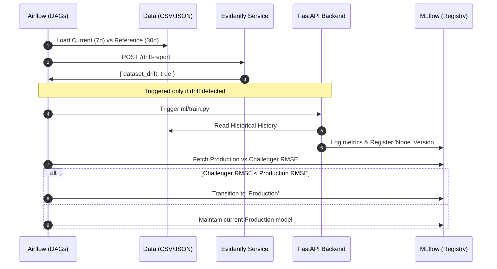

# ️ System Architecture

[← Back to README](../README.md)

## Overview

EcoStock AI is a containerized, microservices-based application. All services are defined in `docker-compose.yml` and communicate over a shared Docker network (`green-tech-inventory_default`).

---

## Container Map

| Container | Image | Port | Role |
|---|---|---|---|
| `postgres` | postgres:15 | 5432 | Stores Airflow metadata + MLflow run history |
| `mlflow` | custom (ghcr.io/mlflow) | 5001→5000 | Experiment tracking + model registry |
| `airflow-init` | custom apache/airflow | — | One-time DB migration + admin user creation |
| `airflow-webserver` | custom apache/airflow | 8080 | DAG UI + REST API |
| `airflow-scheduler` | custom apache/airflow | — | Executes DAG tasks on schedule |
| `backend` | custom python:3.10 | 8000 | FastAPI application server |
| `frontend` | custom node:20-alpine | 5173 | Vite/React dev server |
| `evidently` | custom python:3.10 | 8001 | Drift detection microservice |

---

## Data Flow

### Prediction Request (real-time)
```
Browser → GET /items/{id}/prediction
  → backend loads item from inventory.json
  → backend calls get_ml_prediction(item)
      → loads "Production" model from MLflow registry
      → constructs feature vector [quantity, avg_daily_usage, day_of_week, shelf_life]
      → returns days_until_stockout + insight_message
  → if ML fails → get_fallback_prediction(item)
      → returns quantity / avg_daily_usage
  → response: { days_until_stockout, prediction_source, insight_message }
```

### Automated Drift & Retraining Loop



#### Detailed Logic
1.  **Every hour**: `inference_dag` runs predictions for all items to identify stockout risks.
2.  **Every day**: `drift_detection_dag` sends data to **Evidently AI**.
3.  If drift is confirmed, `retraining_dag` runs.
4.  **Challenger Gating**: A new model is ONLY promoted if it outperforms the current version.

---

## Persistent Storage

| Path | What's stored |
|---|---|
| `./data/inventory.json` | Current inventory state (quantities, metadata) |
| `./data/inventory_seed.json` | Initial seed values (used by reset) |
| `./data/usage_history.csv` | Timestamped daily usage records per item |
| `./mlruns/` | MLflow artifact storage (model files, metrics) |
| `postgres-data` (Docker volume) | Airflow DB + MLflow run metadata |

---

## Startup Dependencies

```
postgres
  ↓
mlflow (depends_on: postgres)
  ↓
airflow-init (depends_on: postgres) → runs DB migrations once, then exits
  ↓
airflow-webserver (depends_on: airflow-init completed)
airflow-scheduler (depends_on: airflow-init completed)
backend (depends_on: mlflow)
frontend (depends_on: backend)
evidently (no dependencies)
```
